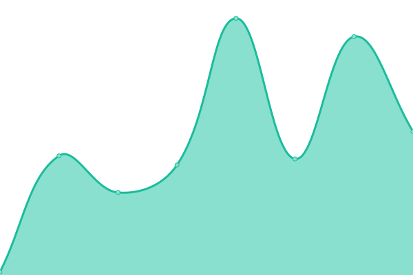
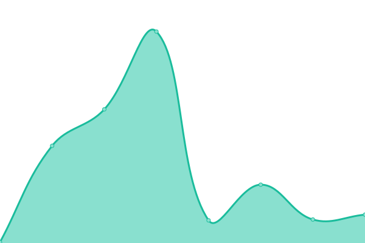
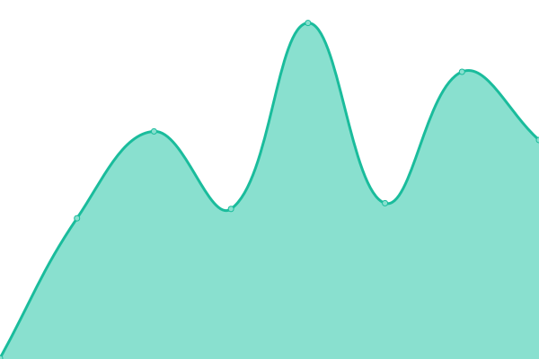

# [📈 Live Status](https://eustasy.github.io/.uptime): <!--live status--> **🟩 All systems operational**

This repository contains the open-source uptime monitor and status page for [eustasy](https://eustasy.org), powered by [Upptime](https://github.com/upptime/upptime).

With [Upptime](https://upptime.js.org), you can get your own unlimited and free uptime monitor and status page, powered entirely by a GitHub repository. We use [Issues](https://github.com/eustasy/.uptime/issues) as incident reports, [Actions](https://github.com/eustasy/.uptime/actions) as uptime monitors, and [Pages](https://eustasy.github.io/.uptime) for the status page.

<!--start: status pages-->
<!-- This summary is generated by Upptime (https://github.com/upptime/upptime) -->
<!-- Do not edit this manually, your changes will be overwritten -->
<!-- prettier-ignore -->
| URL | Status | History | Response Time | Uptime |
| --- | ------ | ------- | ------------- | ------ |
|  [Ashrise A1](https://ashrise.com) | 🟩 Up | [ashrise-a1.yml](https://github.com/eustasy/.uptime/commits/HEAD/history/ashrise-a1.yml) | 

 278ms
     
 | 

<a href="https://eustasy.github.io/.uptime/history/ashrise-a1">100.00%</a>
    

|  [Ashrise P2](https://ashrise.com/phoenix/scrape) | 🟩 Up | [ashrise-p2.yml](https://github.com/eustasy/.uptime/commits/HEAD/history/ashrise-p2.yml) | 

 45ms
     
 | 

<a href="https://eustasy.github.io/.uptime/history/ashrise-p2">100.00%</a>
    

|  [Ashrise MP](https://ashrise.com/torrents) | 🟩 Up | [ashrise-mp.yml](https://github.com/eustasy/.uptime/commits/HEAD/history/ashrise-mp.yml) | 

 89ms
     
 | 

<a href="https://eustasy.github.io/.uptime/history/ashrise-mp">100.00%</a>
    

|  [elementary DL-CDN Amsterdam](https://ams3.dl.elementary.io/) | 🟩 Up | [elementary-dl-cdn-amsterdam.yml](https://github.com/eustasy/.uptime/commits/HEAD/history/elementary-dl-cdn-amsterdam.yml) | 

 767ms
     
 | 

<a href="https://eustasy.github.io/.uptime/history/elementary-dl-cdn-amsterdam">85.68%</a>
    

|  [elementary DL-CDN Frankfurt](https://fra1.dl.elementary.io/) | 🟩 Up | [elementary-dl-cdn-frankfurt.yml](https://github.com/eustasy/.uptime/commits/HEAD/history/elementary-dl-cdn-frankfurt.yml) | 

 639ms
     
 | 

<a href="https://eustasy.github.io/.uptime/history/elementary-dl-cdn-frankfurt">85.68%</a>
    

|  [elementary DL-CDN New York City](https://nyc3.dl.elementary.io/) | 🟩 Up | [elementary-dl-cdn-new-york-city.yml](https://github.com/eustasy/.uptime/commits/HEAD/history/elementary-dl-cdn-new-york-city.yml) | 

 308ms
     
 | 

<a href="https://eustasy.github.io/.uptime/history/elementary-dl-cdn-new-york-city">85.68%</a>
    

|  [elementary DL-CDN San Francisco](https://sfo1.dl.elementary.io/) | 🟩 Up | [elementary-dl-cdn-san-francisco.yml](https://github.com/eustasy/.uptime/commits/HEAD/history/elementary-dl-cdn-san-francisco.yml) | 

 421ms
     
 | 

<a href="https://eustasy.github.io/.uptime/history/elementary-dl-cdn-san-francisco">85.68%</a>
    

|  [elementary DL-CDN Singapore](https://sgp1.dl.elementary.io/) | 🟩 Up | [elementary-dl-cdn-singapore.yml](https://github.com/eustasy/.uptime/commits/HEAD/history/elementary-dl-cdn-singapore.yml) | 

 1042ms
     
 | 

<a href="https://eustasy.github.io/.uptime/history/elementary-dl-cdn-singapore">85.68%</a>
    

<!--end: status pages-->

[**Visit our status website →**](https://eustasy.github.io/.uptime)

## 📄 License

- Powered by: [Upptime](https://github.com/upptime/upptime)
- Code: [MIT](./LICENSE) © [Anand Chowdhary](https://anandchowdhary.com), supported by [Pabio](https://pabio.com)
- Data in the `./history` directory: [Open Database License](https://opendatacommons.org/licenses/odbl/1-0/)
