# [📈 Live Status](https://status.eustasy.org): <!--live status--> **🟩 All systems operational**

This repository contains the open-source uptime monitor and status page for [eustasy](https://eustasy.org), powered by [Upptime](https://github.com/upptime/upptime).

With [Upptime](https://upptime.js.org), you can get your own unlimited and free uptime monitor and status page, powered entirely by a GitHub repository. We use [Issues](https://github.com/eustasy/.uptime/issues) as incident reports, [Actions](https://github.com/eustasy/.uptime/actions) as uptime monitors, and [Pages](https://status.eustasy.org) for the status page.

<!--start: status pages-->
<!-- This summary is generated by Upptime (https://github.com/upptime/upptime) -->
<!-- Do not edit this manually, your changes will be overwritten -->
<!-- prettier-ignore -->
| URL | Status | History | Response Time | Uptime |
| --- | ------ | ------- | ------------- | ------ |
|  [Ashrise A1](https://ashrise.com) | 🟩 Up | [ashrise-a1.yml](https://github.com/eustasy/.uptime/commits/HEAD/history/ashrise-a1.yml) | 

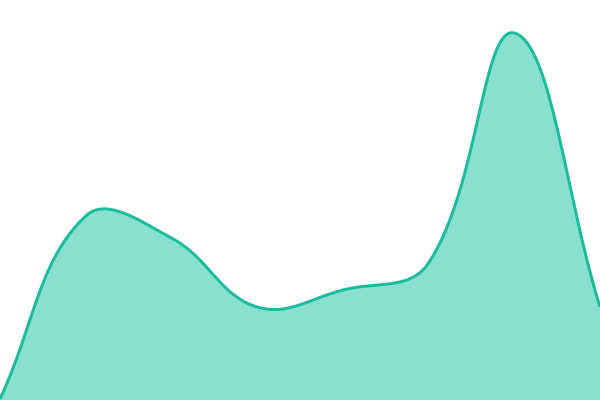 229ms
     
 | 

<a href="https://status.eustasy.org/history/ashrise-a1">100.00%</a>
    

|  [Ashrise P2](https://ashrise.com/phoenix/scrape) | 🟩 Up | [ashrise-p2.yml](https://github.com/eustasy/.uptime/commits/HEAD/history/ashrise-p2.yml) | 

 157ms
     
 | 

<a href="https://status.eustasy.org/history/ashrise-p2">100.00%</a>
    

|  [elementary DL-CDN Amsterdam](https://ams3.dl.elementary.io/) | 🟩 Up | [elementary-dl-cdn-amsterdam.yml](https://github.com/eustasy/.uptime/commits/HEAD/history/elementary-dl-cdn-amsterdam.yml) | 

 1446ms
     
 | 

<a href="https://status.eustasy.org/history/elementary-dl-cdn-amsterdam">100.00%</a>
    

|  [elementary DL-CDN Frankfurt](https://fra1.dl.elementary.io/) | 🟩 Up | [elementary-dl-cdn-frankfurt.yml](https://github.com/eustasy/.uptime/commits/HEAD/history/elementary-dl-cdn-frankfurt.yml) | 

 683ms
     
 | 

<a href="https://status.eustasy.org/history/elementary-dl-cdn-frankfurt">100.00%</a>
    

|  [elementary DL-CDN New York City](https://nyc3.dl.elementary.io/) | 🟩 Up | [elementary-dl-cdn-new-york-city.yml](https://github.com/eustasy/.uptime/commits/HEAD/history/elementary-dl-cdn-new-york-city.yml) | 

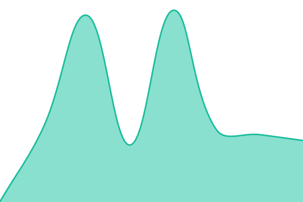 339ms
     
 | 

<a href="https://status.eustasy.org/history/elementary-dl-cdn-new-york-city">100.00%</a>
    

|  [elementary DL-CDN San Francisco](https://sfo1.dl.elementary.io/) | 🟩 Up | [elementary-dl-cdn-san-francisco.yml](https://github.com/eustasy/.uptime/commits/HEAD/history/elementary-dl-cdn-san-francisco.yml) | 

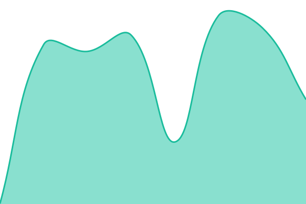 338ms
     
 | 

<a href="https://status.eustasy.org/history/elementary-dl-cdn-san-francisco">100.00%</a>
    

|  [elementary DL-CDN Singapore](https://sgp1.dl.elementary.io/) | 🟩 Up | [elementary-dl-cdn-singapore.yml](https://github.com/eustasy/.uptime/commits/HEAD/history/elementary-dl-cdn-singapore.yml) | 

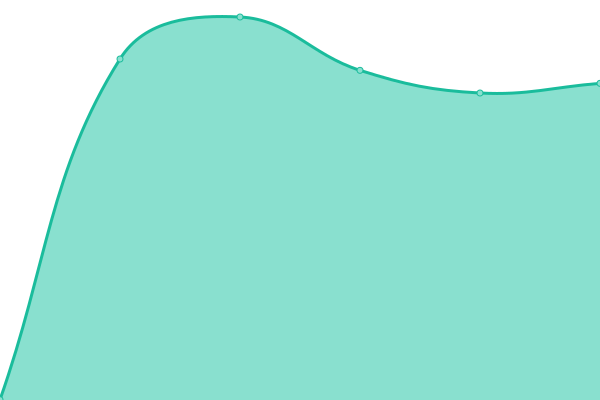 985ms
     
 | 

<a href="https://status.eustasy.org/history/elementary-dl-cdn-singapore">100.00%</a>
    

|  [How to elementary](https://howtoelementary.org/) | 🟩 Up | [how-to-elementary.yml](https://github.com/eustasy/.uptime/commits/HEAD/history/how-to-elementary.yml) | 

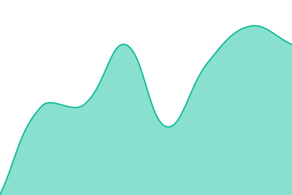 457ms
     
 | 

<a href="https://status.eustasy.org/history/how-to-elementary">100.00%</a>
    

|  [How to Ubuntu](https://howtoubuntu.org/) | 🟩 Up | [how-to-ubuntu.yml](https://github.com/eustasy/.uptime/commits/HEAD/history/how-to-ubuntu.yml) | 

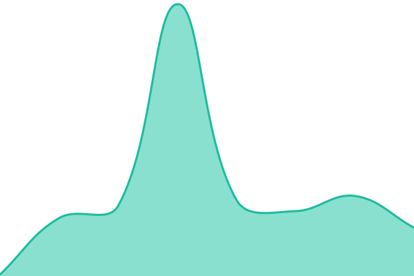 109ms
     
 | 

<a href="https://status.eustasy.org/history/how-to-ubuntu">100.00%</a>
    

|  [eustasy.org](https://eustasy.org) | 🟩 Up | [eustasy-org.yml](https://github.com/eustasy/.uptime/commits/HEAD/history/eustasy-org.yml) | 

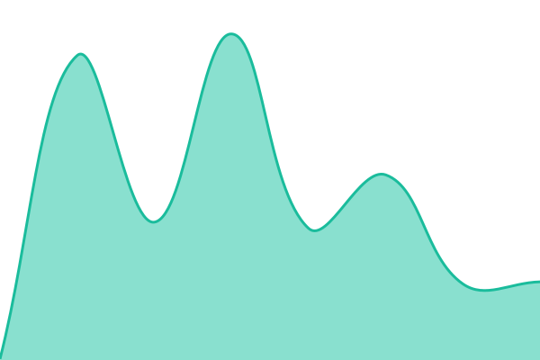 223ms
     
 | 

<a href="https://status.eustasy.org/history/eustasy-org">100.00%</a>
    

|  [www.eustasy.org](https://www.eustasy.org) | 🟩 Up | [www-eustasy-org.yml](https://github.com/eustasy/.uptime/commits/HEAD/history/www-eustasy-org.yml) | 

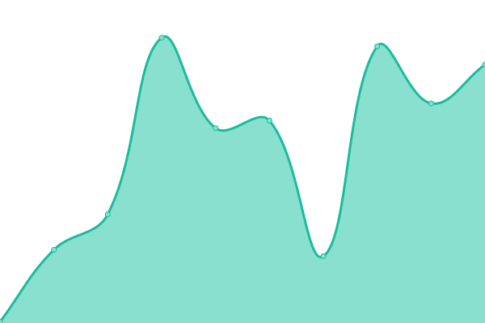 213ms
     
 | 

<a href="https://status.eustasy.org/history/www-eustasy-org">100.00%</a>
    

|  [apple-silicon.eustasy.org](https://apple-silicon.eustasy.org) | 🟩 Up | [apple-silicon-eustasy-org.yml](https://github.com/eustasy/.uptime/commits/HEAD/history/apple-silicon-eustasy-org.yml) | 

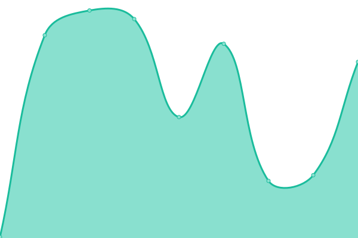 186ms
     
 | 

<a href="https://status.eustasy.org/history/apple-silicon-eustasy-org">100.00%</a>
    

|  [authenticatron.eustasy.org](https://authenticatron.eustasy.org) | 🟩 Up | [authenticatron-eustasy-org.yml](https://github.com/eustasy/.uptime/commits/HEAD/history/authenticatron-eustasy-org.yml) | 

 188ms
     
 | 

<a href="https://status.eustasy.org/history/authenticatron-eustasy-org">100.00%</a>
    

|  [bubbly.eustasy.org](https://bubbly.eustasy.org) | 🟩 Up | [bubbly-eustasy-org.yml](https://github.com/eustasy/.uptime/commits/HEAD/history/bubbly-eustasy-org.yml) | 

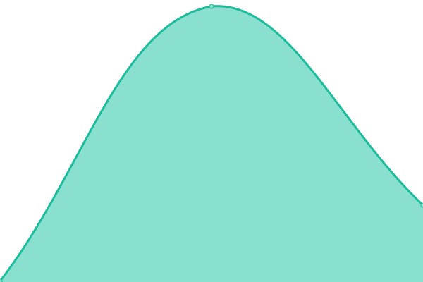 242ms
     
 | 

<a href="https://status.eustasy.org/history/bubbly-eustasy-org">100.00%</a>
    

|  [colors.eustasy.org](https://colors.eustasy.org/) | 🟩 Up | [colors-eustasy-org.yml](https://github.com/eustasy/.uptime/commits/HEAD/history/colors-eustasy-org.yml) | 

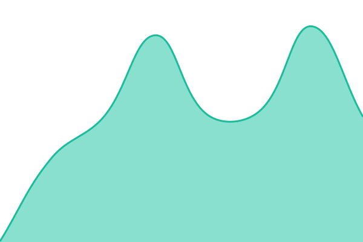 232ms
     
 | 

<a href="https://status.eustasy.org/history/colors-eustasy-org">100.00%</a>
    

|  [extensions.eustasy.org](https://extensions.eustasy.org) | 🟩 Up | [extensions-eustasy-org.yml](https://github.com/eustasy/.uptime/commits/HEAD/history/extensions-eustasy-org.yml) | 

 264ms
     
 | 

<a href="https://status.eustasy.org/history/extensions-eustasy-org">100.00%</a>
    

|  [labs.eustasy.org](https://labs.eustasy.org) | 🟩 Up | [labs-eustasy-org.yml](https://github.com/eustasy/.uptime/commits/HEAD/history/labs-eustasy-org.yml) | 

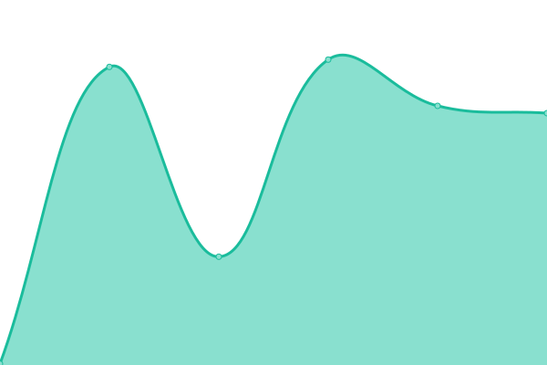 226ms
     
 | 

<a href="https://status.eustasy.org/history/labs-eustasy-org">100.00%</a>
    

|  [puff-serverless.eustasy.org](https://puff-serverless.eustasy.org) | 🟩 Up | [puff-serverless-eustasy-org.yml](https://github.com/eustasy/.uptime/commits/HEAD/history/puff-serverless-eustasy-org.yml) | 

 148ms
     
 | 

<a href="https://status.eustasy.org/history/puff-serverless-eustasy-org">100.00%</a>
    

|  [releases.eustasy.org](https://releases.eustasy.org) | 🟩 Up | [releases-eustasy-org.yml](https://github.com/eustasy/.uptime/commits/HEAD/history/releases-eustasy-org.yml) | 

 193ms
     
 | 

<a href="https://status.eustasy.org/history/releases-eustasy-org">100.00%</a>
    

|  [simplet.eustasy.org](https://simplet.eustasy.org) | 🟩 Up | [simplet-eustasy-org.yml](https://github.com/eustasy/.uptime/commits/HEAD/history/simplet-eustasy-org.yml) | 

 178ms
     
 | 

<a href="https://status.eustasy.org/history/simplet-eustasy-org">100.00%</a>
    

|  [status.eustasy.org](https://status.eustasy.org) | 🟩 Up | [status-eustasy-org.yml](https://github.com/eustasy/.uptime/commits/HEAD/history/status-eustasy-org.yml) | 

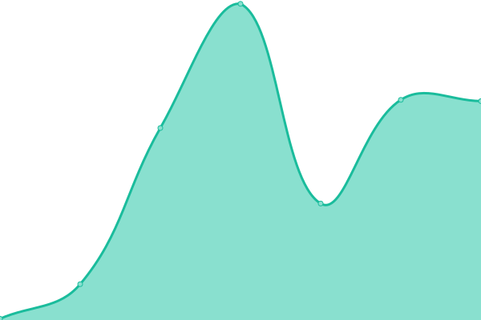 199ms
     
 | 

<a href="https://status.eustasy.org/history/status-eustasy-org">100.00%</a>
    

|  [eustasy.co.uk](https://eustasy.co.uk) | 🟩 Up | [eustasy-co-uk.yml](https://github.com/eustasy/.uptime/commits/HEAD/history/eustasy-co-uk.yml) | 

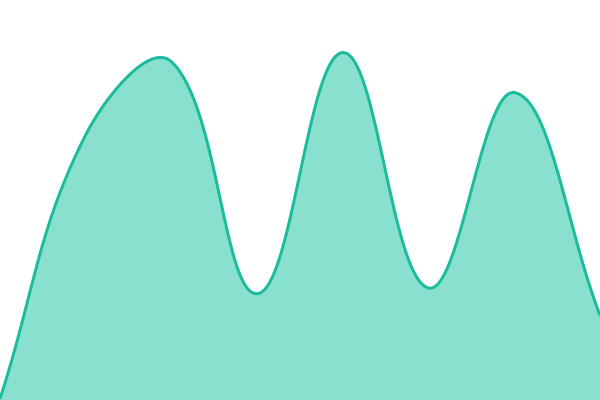 196ms
     
 | 

<a href="https://status.eustasy.org/history/eustasy-co-uk">100.00%</a>
    

|  [www.eustasy.co.uk](https://www.eustasy.co.uk) | 🟩 Up | [www-eustasy-co-uk.yml](https://github.com/eustasy/.uptime/commits/HEAD/history/www-eustasy-co-uk.yml) | 

 167ms
     
 | 

<a href="https://status.eustasy.org/history/www-eustasy-co-uk">100.00%</a>
    

|  [extensions.eustasy.co.uk](https://extensions.eustasy.co.uk) | 🟩 Up | [extensions-eustasy-co-uk.yml](https://github.com/eustasy/.uptime/commits/HEAD/history/extensions-eustasy-co-uk.yml) | 

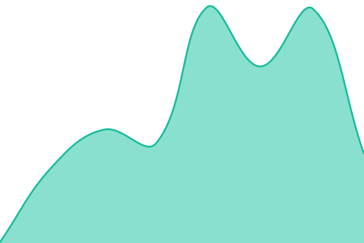 221ms
     
 | 

<a href="https://status.eustasy.org/history/extensions-eustasy-co-uk">100.00%</a>
    

<!--end: status pages-->

[**Visit our status website →**](https://status.eustasy.org)

## 📄 License

- Powered by: [Upptime](https://github.com/upptime/upptime)
- Code: [MIT](./LICENSE) © [Anand Chowdhary](https://anandchowdhary.com), supported by [Pabio](https://pabio.com)
- Data in the `./history` directory: [Open Database License](https://opendatacommons.org/licenses/odbl/1-0/)
